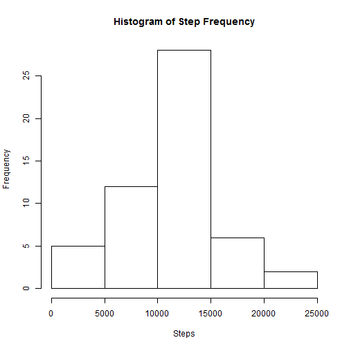
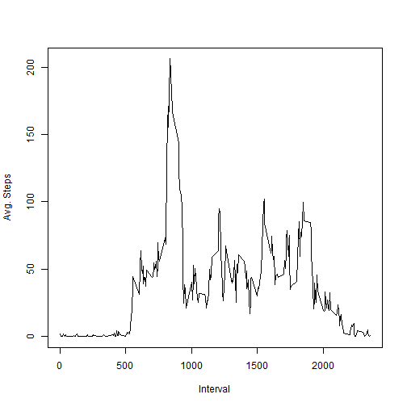
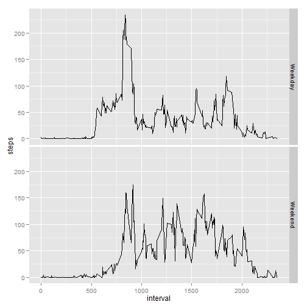

## Loading and preprocessing the data

### Data Loading & Processing:
Data is read in via read.csv. Then a subset is created w/ all of the NAs are removed.


```r
data <- read.csv(unz("activity.zip", "activity.csv"))
compData <- subset(data, !is.na(steps))

library(data.table)
data.dt <- data.table(data)
compData.dt <- data.table(compData)
```

## What is mean total number of steps taken per day?


### Histogram of the number of steps taken per day:

```r
daily <- compData.dt[,list(steps=sum(steps)), by='date']
hist(daily$steps, xlab="Steps", main="Histogram of Step Frequency")
```

 

### Mean & Median of the numbers of steps taken per day:


```r
meanSteps1 <- mean(daily$steps)
print(meanSteps1)
```

```
## [1] 10766.19
```

```r
medianSteps1 <- median(daily$steps)
print(medianSteps1)
```

```
## [1] 10765
```

## What is the average daily activity pattern?

### Time Series Plot of steps taken over 5-minute intervals:


```r
interval <- compData.dt[,list(steps=mean(steps)), by='interval']
plot(interval$interval, interval$steps, type="l", xlab="Interval", ylab="Avg. Steps")
```

 

### Which 5-minute inteval contains the max steps?


```r
maxSteps <- max(interval$steps)
maxInterval <- subset(interval, steps==maxSteps)
print(maxInterval$interval)
```

```
## [1] 835
```

## Inputing missing values

### Number of missing data values:

```r
missingData <- subset(data, is.na(steps))
missingValues <- length(missingData$steps)
print(missingValues)
```

```
## [1] 2304
```

### Missing Data Strategy

For each piece of missing step data, grab the mean steps for that 5-minute intveral across all the data.


```r
newData.dt = data.table(data)

for(i in 1:length(newData.dt$steps))
  {
    if(is.na(newData.dt[i]$steps))
      {
        intervalMean <- subset(interval, interval==newData.dt[i]$interval)
        newData.dt[i]$steps <- as.integer(intervalMean$steps)
      }
  }
```


### Histogram of number of steps taken each day (w/ Missing Data filled in)


```r
daily <- newData.dt[,list(steps=sum(steps)), by='date']
hist(daily$steps, xlab="Steps", main="Histogram of Step Frequency")
```

 


### Mean & Median of the numbers of steps taken per day:


```r
meanSteps2 <- mean(daily$steps)
print(meanSteps2)
```

```
## [1] 10749.77
```

```r
medianSteps2 <- median(daily$steps)
print(medianSteps2)
```

```
## [1] 10641
```

## Are there differences in activity patterns between weekdays and weekends?

### Panel plot of avg steps for Weekdays vs. Weekends:

```r
dayType <- weekdays(as.Date(data.dt$date))
dayType <- gsub("Monday|Tuesday|Wednesday|Thursday|Friday", "Weekday", dayType)
dayType <- gsub("Saturday|Sunday", "Weekend", dayType)

data <- cbind(data, dayType)
compData <- subset(data, !is.na(steps))
compData.dt <- data.table(compData)
interval <- compData.dt[,list(steps=mean(steps)), by=list(dayType,interval)]

library(ggplot2)
qplot(interval, steps, data=interval, facets=dayType ~., geom="line")
```

 


